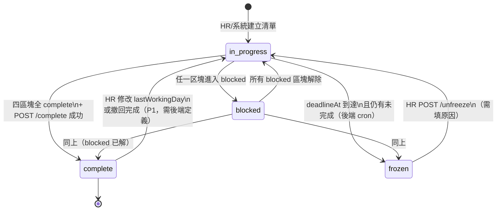
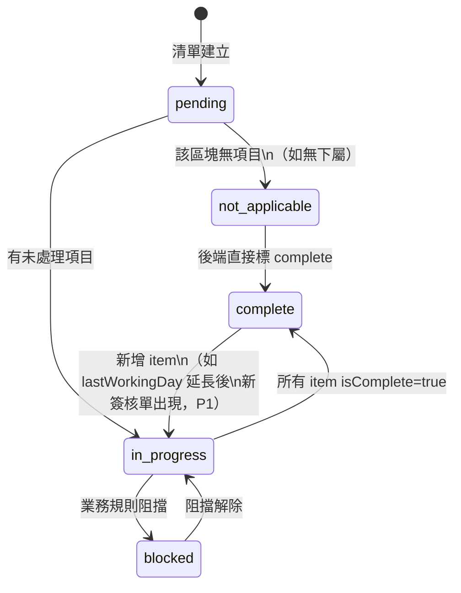

# 狀態流 / State Machine

## 1. 整體清單狀態（OffboardingChecklistStatus）

### 1.1 四態定義

| 狀態 | 代碼 | 語意 | UI 表現 |
|------|------|------|---------|
| 進行中 | `in_progress` | 已建立，截止前，至少一區塊未完成，且無全局 block | 藍色 badge，可操作 |
| 卡住 | `blocked` | 至少一區塊 `blocked`，或全局缺必要輸入（如無可指派主管） | 黃色 badge + ⚠ 原因 |
| 完成 | `complete` | 四區塊全部完成，且後端驗證通過 | 綠色 badge，唯讀 |
| 凍結 | `frozen` | D 日 17:00（`deadlineAt`）後仍有未完成項目 | 灰色 badge + 鎖，僅 HR 可解凍 |

### 1.2 狀態轉換圖



### 1.3 轉換規則詳述

| 轉換 | 觸發者 | 條件 | 前端行為 |
|------|--------|------|----------|
| → `in_progress` | HR / 系統 | 建立清單 | 導向詳情頁 |
| → `blocked` | 後端 | 任一区塊 `status=blocked` 或業務規則無法繼續 | 顯示 `blockReason`，禁用「完成交接」 |
| → `in_progress`（自 blocked） | 後端 | 所有區塊非 blocked | 恢復操作 |
| → `complete` | 主管/HR | 四區塊皆 complete + POST `/complete` 200 | 全頁唯讀，success banner |
| → `frozen` | **後端 cron** | `now >= deadlineAt` 且 `status ∉ {complete}` | 全頁 mutation disabled；彈出凍結說明 |
| `frozen` → `in_progress` | HR | POST `/unfreeze` + audit reason | 恢復操作，保留已完成項目 |
| `complete` → `in_progress` | HR（P1） | 延長在職日 / 撤回離職 | 需 PM 定義是否允許 |

**重要**：前端**不自行**在 client 做 `in_progress → frozen` 轉換後寫入 state。client 倒數僅 UX 提示；以 polling / SSE 收到後端 `status: frozen` 為準。

---

## 2. 區塊狀態（OffboardingSectionStatus）

每個區塊獨立狀態，驅動 stepper 與區塊 header badge。



### 2.1 區塊 → 全局狀態推導（後端責任）

```
if any(section.status == blocked) → checklist.status = blocked
else if all(section.status in [complete, not_applicable]) → 可 POST complete
else if now >= deadlineAt && !allComplete → checklist.status = frozen  (cron)
else → checklist.status = in_progress
```

前端只 render 後端回傳的 `status`，不做本地推導（避免與 cron 競態）。

---

## 3. 截止時間子狀態（Deadline Phase）— UI 用

這不是獨立 API enum，而是前端依 `deadlineAt` + `serverNow` + `checklist.status` 計算的 **display phase**：

| Phase | 條件 | Banner |
|-------|------|--------|
| `normal` | `deadlineAt - serverNow > 72h` | 無 |
| `warning` | 72h ≥ 剩餘 > 24h | 黃色提醒 |
| `critical` | 剩餘 ≤ 24h 且 status = in_progress/blocked | 紅色倒數 |
| `expired` | status = frozen | 灰「已凍結」 |

---

## 4. 簽核代理子狀態（Item-level）

單一 `PendingApprovalItem` 在區塊三內部：

```
pending_delegate → delegate_assigned → confirmed（後端驗證代理人可簽）
                 ↘ delegate_invalid（代理人無權限 → 區塊 blocked）
```

前端 PATCH delegate 後 poll 直到 `isComplete=true` 或收到 error code。

---

## 5. 序列範例：正常完成路徑

```
T0  HR 建立清單                    status: in_progress
T1  區塊一 N/A（無下屬）            section1: not_applicable
T2  區塊二指派 3/3 模板            section2: complete
T3  區塊三指派 2/2 簽核代理         section3: complete
T4  HR 勾選區塊四 + 標記已通知 IT   section4: complete
T5  POST /complete                 status: complete
```

## 6. 序列範例：凍結路徑

```
T0  建立清單，deadlineAt = D 17:00
...
T-1 16:50 區塊四仍未確認           status: in_progress, phase: critical
T0 17:00 後端 cron                 status: frozen, frozenAt set
T1 前端 poll 收到 frozen           禁用所有 mutation，顯示 HR 解凍 CTA
T2 HR unfreeze + 完成區塊四         status: in_progress（或延長 deadline 後 in_progress）
T3 POST /complete                  status: complete
```

## 7. 序列範例：卡住 → 解除

```
T0  離職者為「離職交接清單」模板負責人
    section2: blocked（需 HR Admin 群組確認）
    checklist: blocked
T1  HR 點「確認轉移至 HR Admin 群組」
    PATCH form-templates/{id} with forcedTransfer
    section2: complete
    checklist: in_progress
```

---

## 8. 前端 state 管理建議

```typescript
// Jotai atom 示意 — scoped by checklistId
interface OffboardingPageState {
  detail: OffboardingChecklistDetail | null;
  isLoading: boolean;
  mutationInFlight: Set<string>;  // item id 級別 lock
  lastSyncedAt: string;
  pollIntervalMs: number;         // frozen 前 30s，critical 10s
}
```

- **不用**把 global checklist status 存在 localStorage（multi-tenant 風險）。
- tenant 切換時 clear atom（呼應 #4801）。
- `frozen` 後停止 mutation queue，只保留 read + export。
